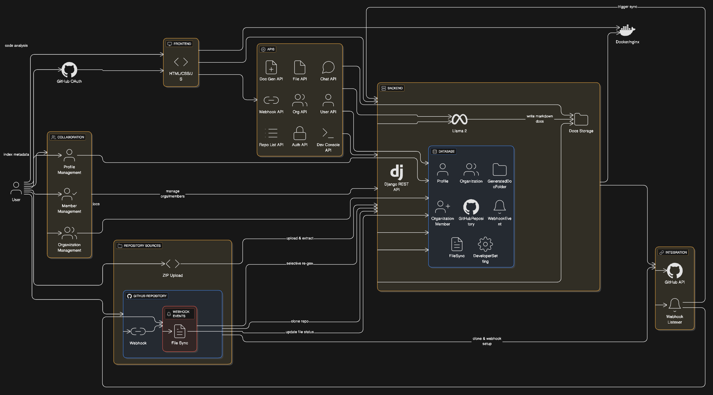

# repo2doc

**AI-powered repository-to-documentation generator with quick code insights**

*Future developers will still need documentation, but from now on, it's AI-powered.*

---

## 🚀 Overview

repo2doc is an intelligent documentation generation platform that transforms any code repository into comprehensive, AI-generated documentation. Whether you upload a ZIP file or provide a GitHub URL, our system automatically analyzes your codebase and creates detailed markdown documentation with smart insights.

## DEMO


## ✨ Key Features

- **Multi-Input Support**: Upload ZIP files or provide GitHub repository URLs
- **AI-Powered Analysis**: Uses Llama 2 7B model for intelligent code documentation
- **Real-time Sync**: Automatic webhook integration for GitHub repositories
- **Organization Management**: Create teams and collaborate on documentation
- **Interactive Chat**: Query your code using natural language
- **User Authentication**: GitHub OAuth integration for seamless access
- **Responsive UI**: Modern, dark-themed interface optimized for developers

---

## 🏗️ Technical Architecture

### Core Tech Stack

```
Backend: Django 4.2.23 + Django REST Framework
Database: SQLite3 (Development) / PostgreSQL (Production)
AI Engine: Llama (llama-cpp-python)
Authentication: GitHub OAuth 2.0
Webhooks: GitHub Webhook API
Frontend: HTML5, CSS3, JavaScript (Vanilla)
```

## System Architecture



```
┌─────────────────┐    ┌──────────────────┐    ┌─────────────────┐
│   Client Web    │    │   Django API     │    │   AI Engine     │
│   Interface     │◄──►│   (REST)         │◄──►│   (Llama)     │
└─────────────────┘    └──────────────────┘    └─────────────────┘
                               │
                               ▼
                       ┌──────────────────┐    ┌─────────────────┐
                       │   File System    │    │   GitHub API    │
                       │   (Docs Storage) │    │   (Webhooks)    │
                       └──────────────────┘    └─────────────────┘
```

---

## 🔧 Technical Workflow

### 1. Repository Input Processing

**ZIP Upload Flow:**
- User uploads ZIP file through web interface
- System extracts ZIP to temporary directory
- File system traversal identifies code files
- Each code file content is processed through AI model
- Generated documentation saved as markdown files
- Documentation stored in organized folder structure

**GitHub URL Flow:**
- User provides GitHub repository URL
- System clones repository to local storage
- Optional webhook setup for real-time synchronization
- File processing follows same pattern as ZIP upload
- Repository metadata stored for future sync operations

### 2. AI Documentation Generation

**Llama Model Integration:**
- Context window: 4000 tokens for comprehensive analysis
- Smart chunking system for large files
- Optimized prompts for different file types
- Temperature controlled for consistent output
- Response parsing and markdown formatting

**Processing Pipeline:**
- File content analysis and categorization
- Dynamic prompt generation based on file type
- AI model inference with optimized parameters
- Response validation and formatting
- Documentation file creation and storage

### 3. Real-time Synchronization

**GitHub Webhook Integration:**
- Automated webhook creation during repository setup
- Secure signature verification for incoming events
- Event parsing for push, pull request, and other triggers
- Intelligent file change detection and processing
- Selective documentation regeneration for efficiency

**Synchronization Process:**
- Webhook event reception and validation
- Changed file identification from commit data
- Selective AI processing for modified files only
- Documentation update with version tracking
- Error handling and retry mechanisms```

---

## 🗄️ Database Schema

The system uses a relational database with the following detailed schema:

### Core Models

#### 1. GeneratedDocFolder (dashboard_generateddocfolder)
| Field | Type | Key | Null | Default | Description |
|-------|------|-----|------|---------|-------------|
| id | AutoField | PK | No | - | Primary key |
| folder_path | TextField | - | No | - | Path to generated documentation |
| uploaded_at | DateTimeField | - | No | auto_now_add | Document creation timestamp |
| user_id | ForeignKey(User) | FK | Yes | NULL | Document owner |
| visibility | CharField(20) | - | No | 'public' | Access level (public/private/organization) |
| organization_id | ForeignKey(Organization) | FK | Yes | NULL | Associated organization |
| source_type | CharField(10) | - | No | 'upload' | Source type (upload/github) |
| auto_sync | BooleanField | - | No | False | Auto-sync enabled flag |
| github_token | CharField(255) | - | Yes | NULL | Encrypted GitHub token |

#### 2. Profile (users_profile)
| Field | Type | Key | Null | Default | Description |
|-------|------|-----|------|---------|-------------|
| id | AutoField | PK | No | - | Primary key |
| user_id | OneToOneField(User) | FK | No | - | Django User reference |
| github_id | CharField(100) | - | Yes | NULL | GitHub user ID |
| github_username | CharField(100) | - | Yes | NULL | GitHub username |
| avatar_url | URLField(500) | - | Yes | NULL | GitHub profile image |
| encrypted_github_token | TextField | - | Yes | NULL | Encrypted GitHub access token |

#### 3. Organization (organization_organization)
| Field | Type | Key | Null | Default | Description |
|-------|------|-----|------|---------|-------------|
| id | AutoField | PK | No | - | Primary key |
| name | CharField(200) | - | No | - | Organization name |
| unique_id | UUIDField | UK | No | uuid4() | Unique organization identifier |
| description | TextField | - | Yes | NULL | Organization description |
| creator_id | ForeignKey(User) | FK | No | - | Organization creator |
| created_at | DateTimeField | - | No | auto_now_add | Creation timestamp |

#### 4. OrganizationMember (organization_organizationmember)
| Field | Type | Key | Null | Default | Description |
|-------|------|-----|------|---------|-------------|
| id | AutoField | PK | No | - | Primary key |
| organization_id | ForeignKey(Organization) | FK | No | - | Organization reference |
| user_id | ForeignKey(User) | FK | No | - | User reference |
| role | CharField(10) | - | No | 'member' | Member role (admin/member) |
| joined_at | DateTimeField | - | No | auto_now_add | Join timestamp |

#### 5. GitHubRepository (webhook_githubrepository)
| Field | Type | Key | Null | Default | Description |
|-------|------|-----|------|---------|-------------|
| id | AutoField | PK | No | - | Primary key |
| doc_folder_id | OneToOneField(GeneratedDocFolder) | FK | No | - | Associated documentation |
| github_url | URLField(500) | - | No | - | GitHub repository URL |
| owner | CharField(100) | - | No | - | Repository owner |
| repo_name | CharField(100) | - | No | - | Repository name |
| branch | CharField(100) | - | No | 'main' | Tracked branch |
| webhook_id | CharField(100) | - | Yes | NULL | GitHub webhook ID |
| webhook_secret | CharField(100) | - | No | uuid4()[:32] | Webhook validation secret |
| is_webhook_active | BooleanField | - | No | False | Webhook status |
| auto_sync_enabled | BooleanField | - | No | True | Auto-sync enabled flag |
| last_commit_sha | CharField(40) | - | Yes | NULL | Last processed commit |
| last_sync_at | DateTimeField | - | Yes | NULL | Last sync timestamp |
| sync_failures | IntegerField | - | No | 0 | Failed sync attempts |
| last_sync_error | TextField | - | Yes | NULL | Last sync error message |
| created_at | DateTimeField | - | No | auto_now_add | Creation timestamp |
| updated_at | DateTimeField | - | No | auto_now | Update timestamp |

#### 6. WebhookEvent (webhook_webhookevent)
| Field | Type | Key | Null | Default | Description |
|-------|------|-----|------|---------|-------------|
| id | AutoField | PK | No | - | Primary key |
| github_repo_id | ForeignKey(GitHubRepository) | FK | No | - | Repository reference |
| event_type | CharField(20) | - | No | - | Event type (push/ping/pull_request/other) |
| github_delivery_id | CharField(100) | UK | No | - | GitHub delivery ID |
| commit_sha | CharField(40) | - | Yes | NULL | Commit SHA |
| status | CharField(20) | - | No | 'pending' | Processing status |
| error_message | TextField | - | Yes | NULL | Error details |
| files_processed | IntegerField | - | No | 0 | Number of processed files |
| payload | JSONField | - | Yes | NULL | Raw webhook payload |
| created_at | DateTimeField | - | No | auto_now_add | Creation timestamp |
| processed_at | DateTimeField | - | Yes | NULL | Processing timestamp |

#### 7. FileSync (webhook_filesync)
| Field | Type | Key | Null | Default | Description |
|-------|------|-----|------|---------|-------------|
| id | AutoField | PK | No | - | Primary key |
| webhook_event_id | ForeignKey(WebhookEvent) | FK | No | - | Associated webhook event |
| file_path | CharField(500) | - | No | - | File path in repository |
| action | CharField(20) | - | No | - | File action (added/modified/removed) |
| success | BooleanField | - | No | False | Processing success flag |
| error_message | TextField | - | Yes | NULL | Processing error |
| created_at | DateTimeField | - | No | auto_now_add | Creation timestamp |

#### 8. DeveloperSetting (developer_console_developersetting)
| Field | Type | Key | Null | Default | Description |
|-------|------|-----|------|---------|-------------|
| id | AutoField | PK | No | - | Primary key |
| user_id | OneToOneField(User) | FK | No | - | User reference |
| github_token | CharField(255) | - | Yes | NULL | Developer GitHub token |
| created_at | DateTimeField | - | No | auto_now_add | Creation timestamp |
| updated_at | DateTimeField | - | No | auto_now | Update timestamp |

### Database Relationships

```
User (Django Auth)
├── Profile (1:1)
├── GeneratedDocFolder (1:N) 
├── Organization (1:N as creator)
├── OrganizationMember (1:N)
└── DeveloperSetting (1:1)

GeneratedDocFolder
├── GitHubRepository (1:1)
└── Organization (N:1)

GitHubRepository
└── WebhookEvent (1:N)

WebhookEvent
└── FileSync (1:N)

Organization
├── OrganizationMember (1:N)
└── GeneratedDocFolder (1:N)
```

---

## 🔄 API Endpoints

### Documentation Generation APIs

#### Generate Documentation
```http
POST /api/repo2doc/
Content-Type: multipart/form-data

Parameters:
- zip_file: File upload (ZIP archive)
- github_url: String (GitHub repository URL)
- visibility: String (public/private/organization)
- organization: Integer (Organization ID, optional)
- auto_sync: Boolean (Enable auto-sync for GitHub repos)
- github_token: String (GitHub access token, optional)

Response:
{
    "success": true,
    "doc_id": 123,
    "message": "Documentation generated successfully"
}
```

#### AI Model Processing
```http
POST /ai_model/api/
Content-Type: application/json

Body:
{
    "prompt": "Generate documentation for this code...",
    "content_type": "code",
    "max_tokens": 500
}

Response:
{
    "generated_text": "# Documentation\n\nThis module provides...",
    "tokens_used": 245
}
```

### File Management APIs

#### Get File Content
```http
GET /api/file-content/
Parameters:
- path: String (Relative file path)
- doc_id: Integer (Documentation folder ID)

Response:
{
    "raw_content": "# File content in markdown format",
    "path": "src/main.py"
}
```

#### List Repository Files
```http
GET /doc_view/view/{doc_id}/
Response: HTML page with file tree and content viewer
```

### Interactive Chat APIs

#### Chat with Code
```http
POST /chat/api/
Content-Type: application/json

Body:
{
    "message": "Explain this function",
    "file_content": "def example_function():\n    pass",
    "file_name": "utils.py"
}

Response:
{
    "response": "This function is a placeholder that...",
    "file_context": "utils.py"
}
```

### Webhook Management APIs

#### GitHub Webhook Receiver
```http
POST /webhook/github/{repo_id}/
Headers:
- X-GitHub-Event: push
- X-GitHub-Delivery: 12345-67890
- X-Hub-Signature-256: sha256=...

Body: GitHub webhook payload

Response:
{
    "status": "processed",
    "files_updated": 3,
    "event_id": "webhook_event_456"
}
```

#### Setup Webhook
```http
POST /webhook/api/setup/
Content-Type: application/json

Body:
{
    "doc_id": 123,
    "github_token": "ghp_...",
    "events": ["push", "pull_request"]
}

Response:
{
    "webhook_id": "12345",
    "webhook_url": "https://api.github.com/repos/owner/repo/hooks/12345",
    "status": "active"
}
```

#### Webhook Status
```http
GET /webhook/api/status/{doc_id}/

Response:
{
    "webhook_active": true,
    "last_sync": "2025-01-15T10:30:00Z",
    "sync_failures": 0,
    "repository": {
        "owner": "username",
        "repo": "repository-name",
        "branch": "main"
    }
}
```

### Organization Management APIs

#### List Organizations
```http
GET /organization/

Response: HTML page with organization list
```

#### Create Organization
```http
POST /organization/create/
Content-Type: application/x-www-form-urlencoded

Body:
name=My+Organization&description=Team+collaboration+space

Response: Redirect to organization detail page
```

#### Join Organization
```http
POST /organization/join/
Content-Type: application/x-www-form-urlencoded

Body:
organization_id=f47ac10b-58cc-4372-a567-0e02b2c3d479

Response:
{
    "success": true,
    "message": "Successfully joined organization",
    "role": "member"
}
```

#### Organization Details
```http
GET /organization/{org_id}/

Response: HTML page with organization details and member management
```

### User Management APIs

#### User Profile
```http
GET /users/profile/

Response: HTML page with user profile and settings
```

#### Update GitHub Token
```http
POST /users/profile/
Content-Type: application/x-www-form-urlencoded

Body:
github_token=ghp_new_token_here

Response: Profile page with success message
```

### Developer Console APIs

#### Dashboard
```http
GET /developer-console/

Response: HTML page with GitHub repository overview and statistics
```

#### Auto-Sync Settings
```http
GET /developer-console/auto-sync/{doc_id}/
POST /developer-console/auto-sync/{doc_id}/

GET Response: HTML page with sync configuration
POST Body:
action=enable&github_token=ghp_token

POST Response:
{
    "success": true,
    "webhook_configured": true,
    "sync_enabled": true
}
```

#### Webhook Logs
```http
GET /developer-console/logs/{doc_id}/

Response: HTML page with webhook event history and file sync details
```

### Repository Listing APIs

#### Public Repositories
```http
GET /list/public/
Parameters:
- page: Integer (Page number, default: 1)

Response: HTML page with paginated public repository list
```

#### Private Repositories
```http
GET /list/private/
Parameters:
- page: Integer (Page number, default: 1)

Response: HTML page with paginated private repository list (requires authentication)
```

#### My Repositories
```http
GET /list/my/
Parameters:
- page: Integer (Page number, default: 1)

Response: HTML page with user's repositories (requires authentication)
```

#### Organization Repositories
```http
GET /list/organization/
Parameters:
- page: Integer (Page number, default: 1)

Response: HTML page with organization repositories (requires membership)
```

### Authentication APIs

#### GitHub OAuth Login
```http
GET /users/login/

Response: Redirect to GitHub OAuth authorization
```

#### OAuth Callback
```http
GET /complete/github/
Parameters: OAuth callback parameters from GitHub

Response: Redirect to user profile or home page
```

#### Logout
```http
GET /users/logout/

Response: Redirect to home page with session cleared
```

### Error Responses

All APIs return appropriate HTTP status codes:

```json
// 400 Bad Request
{
    "error": "Invalid parameters",
    "details": "Missing required field: github_url"
}

// 401 Unauthorized
{
    "error": "Authentication required",
    "login_url": "/users/login/"
}

// 404 Not Found
{
    "error": "Resource not found",
    "resource": "Documentation with ID 999"
}

// 500 Internal Server Error
{
    "error": "Internal server error",
    "message": "AI model temporarily unavailable"
}
```

---

## 🔧 Setup & Installation

### Prerequisites

```bash
Python 3.8+
Django 4.2+
SQLite3/PostgreSQL
Llama  model
GitHub OAuth App
```

### Local Development

```bash
# Clone repository
git clone https://github.com/your-repo/repo2doc.git
cd repo2doc

# Create virtual environment
python -m venv venv
source venv/bin/activate

# Install dependencies
pip install -r requirements.txt

# Environment setup
cp .env.example .env
# Configure GitHub OAuth, model paths, etc.

# Database migration
python manage.py migrate

# Download Llama model
cd /home/workspace/llama.cpp
wget https://huggingface.co/TheBloke/Llama-2-7B-Chat-GGUF/resolve/main/llama-2-7b-chat.Q4_K_M.gguf

# Run development server
python manage.py runserver
```

---

## 🎯 Key Components Integration

### Authentication Flow
```
GitHub OAuth → User Profile Creation → Token Storage → API Access
```

### Documentation Pipeline
```
Code Input → AI Processing → Markdown Generation → File Storage → Web Display
```

### Webhook Synchronization
```
GitHub Push → Webhook Trigger → File Diff Analysis → Selective Re-generation → Documentation Update
```

### Organization Workflow
```
Org Creation → Member Invitation → Shared Repository Access → Collaborative Documentation
```

---

## 🚀 Performance & Scalability

### AI Model Optimization
- **Context Window**: 4000 tokens for comprehensive analysis
- **Token Limiting**: Smart chunking for large files
- **Response Caching**: Avoid redundant AI calls for unchanged files

### File Processing
- **Async Processing**: Background task queues for large repositories
- **Smart Filtering**: Process only relevant code files
- **Incremental Updates**: Webhook-driven selective regeneration

### Database Design
- **Efficient Indexing**: Optimized queries for file retrieval
- **Relationship Management**: Clean foreign key structure
- **Data Archival**: Automatic cleanup of old documentation versions

---

## 🔮 Future Enhancements

- **Advanced Code Analysis**: Dependency graphs, complexity metrics
- **Real-time Collaboration**: Live editing and commenting
- **CI/CD Integration**: Pipeline hooks for documentation updates
- **Enterprise Features**: SSO, advanced analytics, compliance tools

---

## 📝 License

This project is licensed under the MIT License - see the [LICENSE](LICENSE) file for details.

---

## 🤝 Contributing

1. Fork the repository
2. Create your feature branch (`git checkout -b feature/AmazingFeature`)
3. Commit your changes (`git commit -m 'Add some AmazingFeature'`)
4. Push to the branch (`git push origin feature/AmazingFeature`)
5. Open a Pull Request

---

*Built with ❤️ for developers who believe documentation should be as smart as the code it describes.*